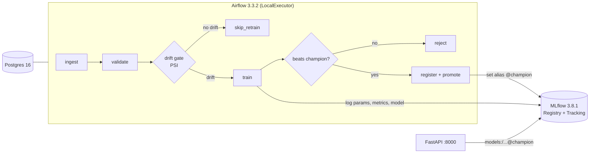

# mlops-mini

A small end-to-end MLOps stack: an **Airflow** pipeline trains a model, records it in the
**MLflow** Model Registry, and a **FastAPI** service serves whatever the registry marks as
champion. Everything runs from one `docker compose up`.

The dataset ships inside scikit-learn (`load_breast_cancer`), so no step needs the network.

## Architecture



The pipeline retrains only when the incoming batch actually looks different, and promotes
only when the new model beats the incumbent. Those two gates are the point of the project —
without them this would be a cron job that overwrites production on every run.

## Services

| Service | Port | Purpose |
|---|---|---|
| `airflow-apiserver` | 8080 | Airflow UI and REST API |
| `airflow-scheduler` | – | schedules task instances |
| `airflow-dag-processor` | – | parses DAG files (a separate service in Airflow 3) |
| `airflow-triggerer` | – | required for Airflow to report itself healthy |
| `postgres` | – | Airflow metadata database |
| `mlflow` | 5000 | tracking server, artifact store and Model Registry |
| `api` | 8000 | FastAPI serving the champion model |

Host ports come from `.env` (`AIRFLOW_PORT`, `MLFLOW_PORT`, `API_PORT`) so you can move them
if something already owns a default.

## Quick start

```bash
cp .env.example .env
docker compose up -d --build       # or: make up
```

Then:

1. Open Airflow at <http://localhost:8080> (login `admin` / `admin`).
2. Trigger `training_pipeline` with a config that simulates drifted input:

   ```bash
   make trigger
   # docker compose exec airflow-scheduler \
   #   airflow dags trigger training_pipeline --conf '{"shift": 1.5, "batch_rows": 200}'
   ```

3. Watch the run in Airflow and the experiment at <http://localhost:5000>.
4. Point the API at the freshly promoted model and predict:

   ```bash
   curl -X POST http://localhost:8000/reload
   curl http://localhost:8000/model
   ```

Trigger with `{"shift": 0.0}` instead and the drift gate routes to `skip_retrain` — the
champion is left alone. That is the behaviour to demonstrate both ways.

## API

| Endpoint | Purpose |
|---|---|
| `GET /healthz` | liveness — the process is up |
| `GET /readyz` | readiness — 503 until a model is loaded |
| `GET /model` | name, alias, version, run id and metrics of the loaded model |
| `POST /reload` | re-resolve `models:/<name>@champion` from the registry |
| `POST /predict` | `{"rows": [{"mean_radius": 17.99, ...}]}` |
| `GET /metrics` | Prometheus metrics |
| `GET /docs` | OpenAPI UI |

The API starts even when the registry is empty: `/healthz` stays green, `/readyz` and
`/predict` return 503 until the first promotion. That keeps the container from crash-looping
before the pipeline has ever run.

## Drift gate

`src/mlops/drift.py` computes the Population Stability Index per feature against the
reference sample, and the DAG branches on the maximum.

The bin count adapts to the sample size (~50 rows per bin). This matters: with a fixed
10 bins, an *undrifted* 200-row batch already reaches a max PSI of ~0.17 across 30
features, which would fire a 0.2 threshold on sampling noise alone. Measured on this
dataset with adaptive binning:

| | value |
|---|---|
| worst max-PSI with no drift (4 batch sizes x 8 seeds) | **0.136** |
| threshold | **0.2** |
| weakest max-PSI with `shift=1.5` | **6.91** |

Tune the threshold with `DRIFT_PSI_THRESHOLD`.

## Model promotion

MLflow 3 replaced the old `Staging`/`Production` stages with aliases, so promotion means
moving the `champion` alias onto a new version:

```python
client.set_registered_model_alias(model_name, "champion", version)
```

The API resolves `models:/breast-cancer-classifier@champion` and never hardcodes a version.

## Development

```bash
python3.12 -m venv .venv && source .venv/bin/activate
pip install -r api/requirements.txt pytest ruff httpx

make test    # pytest
make lint    # ruff
```

Tests stub the registry out, so the suite never touches the network or needs a running
MLflow server.

## Layout

```
dags/training_pipeline.py   Airflow DAG: the two gates live here
src/mlops/                  shared library, used by both the DAG and the API
  config.py                 settings from environment variables
  data.py                   dataset loading and batch simulation
  drift.py                  PSI and the drift verdict
  train.py                  estimator, evaluation, MLflow logging
  registry.py               register, promote by alias, load champion
api/main.py                 FastAPI serving layer
tests/                      unit tests for drift, data, training and the API
.github/workflows/ci.yml    lint + test, image builds, compose validation
```

## Configuration that is easy to get wrong

Three settings in `docker-compose.yml` are not optional, and each fails in a way that does
not name itself. They are commented in place; repeated here because they cost real time:

| Setting | Symptom when missing |
|---|---|
| `AIRFLOW__CORE__EXECUTION_API_SERVER_URL` | every task fails with `httpx.ConnectError: Connection refused` — Airflow 3 runs tasks through the Task SDK, which calls back into the API server, and the default points at `localhost` |
| `AIRFLOW__API_AUTH__JWT_SECRET` | tasks fail with `ServerResponseError: Invalid auth token` — every Airflow service must sign with the same secret |
| `mlflow server --allowed-hosts` | training fails with `403 Invalid Host header - possible DNS rebinding attack detected` — MLflow only accepts Host headers it knows, and the compose service name is not one by default |

## Notes

* `AIRFLOW__CORE__SIMPLE_AUTH_MANAGER_*` is Airflow 3's default auth manager. It is meant
  for development only — do not expose this compose file to a network you do not control.
* The MLflow server uses SQLite and a local artifact volume. Fine for one machine; swap the
  backend store for Postgres and the artifact store for S3/MinIO before sharing it.
* `--allowed-hosts` is scoped to the compose network plus localhost. Widen it only if you
  move MLflow behind another hostname.
